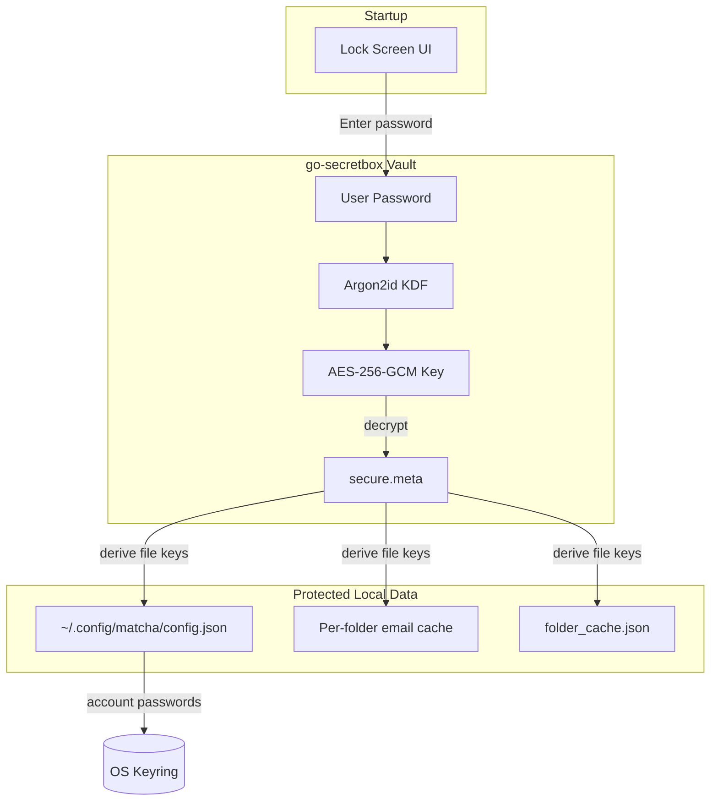

# Encryption

Matcha supports optional full-disk encryption of all local data using a password you choose. The password is never stored anywhere — not on disk, not in the OS keyring, not in environment variables. You enter it each time you open matcha.

## Architecture



Encryption is powered by [**go-secretbox**](https://github.com/floatpane/go-secretbox). Full specification and technical details are at [secretbox.floatpane.com](https://secretbox.floatpane.com).

## Enabling Encryption

1. Open **Settings** from the main menu.
2. Select **Encryption: OFF**.
3. Enter a password and confirm it.
4. Press **Enable Encryption**.

All existing data files will be encrypted immediately. On next launch, matcha will prompt for your password before showing anything.

## Unlocking Matcha

When encryption is enabled, matcha shows a lock screen on startup:

```
matcha is locked

> ********

enter: unlock | ctrl+c: quit
```

Enter your password to decrypt and proceed. If the password is wrong, you'll see an error and can try again.

## Disabling Encryption

1. Open **Settings** from the main menu.
2. Select **Encryption: ON**.
3. Confirm with **y** when prompted.

All files will be decrypted back to plain JSON, account passwords will be restored to the OS keyring, and the `secure.meta` file will be removed.

## Important Notes

- **If you forget your password, your data cannot be recovered.** There is no reset mechanism.
- The encryption protects data at rest. Once unlocked, data is decrypted in memory for the session.
- PGP keys and S/MIME certificates referenced by path in your config are not encrypted by matcha (they are external files managed by you).
- OAuth2 tokens are managed separately and are not covered by this encryption.
